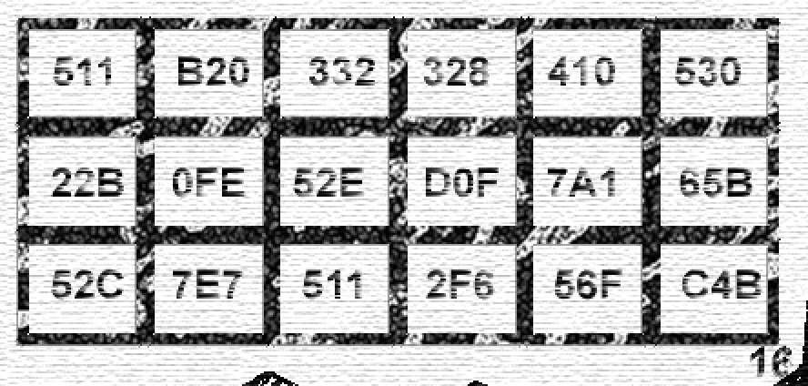

# BitcoinChallenge310

追踪 BitcoinChallenge 最新解密进展。

## 0.1 BTC(solved)

### 线索一：藏在图里的日期


图里有一行小字： “OCT 2 2018”，作为移位用的 shift key：`20181002`

### 线索二


下方的 6x3 表格里，有一些16进制的数据，整理出来：`511B2033232841053022B0FE52ED0F7A165B52C7E75112F656FC4B`

结合两条线索，使用移位算法，得出一串16进制的字符串 `3103103103103103101aa0fc32d5ff78f64342c5c74902f436e43b`

根据之前的 6x3 格式拆开，3位一组。

第一行 `310` 是告诉玩家，这是 310 游戏的一个答案。

将其他两列转成10进制数字。

得到12个数字 “426，252，813，1535，1935，1603，1068，1479，1168，756，878，1083”

对应是的是 `bitcoin` 助记词的 index。

助记词地址: https://github.com/bitcoin/bips/blob/master/bip-0039/english.txt

对应结果是：“cry buyer grain save vault sign lyrics rhythm music fury horror mansion”。

解开的钱包地址和私钥：

>1446C8HqMtvWtEgu1JnjwLcPESSruhzkmV
KzkZxdhRGxB7eX4u1skXkfJ7VB8JfPp7Nfos3jiF7PQUNMh2SHDE

移位算法参考的[这位兄弟](https://gist.github.com/jin10086/cedc8a833dc20f0101798a89893be657)的算法，原代码是 python 的，改写了一个 js 版本:

```js
const key = "20181002"
const encrypted = "511B2033232841053022B0FE52ED0F7A165B52C7E75112F656FC4B"
const x = []
for (let i = 0, len = encrypted.length; i < len; i++) {
  const a = parseInt(encrypted[i], 16)
  const b = parseInt(key[i % 8])
  let c = a - b
  if (c < 0) {
    c += 16
  }
  x.push(c.toString(16))
}
console.log(x.join(''))
```

## 0.2 BTC(solved)

## 0.31 BTC(unsolved)

## 310 BTC(unsolved)

## 参考链接
- [极客与艺术：赢取 310 BTC 的正确解密方式](https://mp.weixin.qq.com/s/GWwxOhAriwKGVIhGRYSAFg)
- [Bitcoin forum](https://bitcointalk.org/index.php?topic=5042285.40)
- 移位算法代码 https://gist.github.com/jin10086/cedc8a833dc20f0101798a89893be657
